**Note:** There is a bug with the github DownloadZIP(".map" asset file are Git LFS file, Github DownloadZIP results in the ".map" file only 1KB).  **You should clone this repository by HTTPs of this git, Not by Github DownloadZIP.**

# PRODUCT TITLE：

**UE-Http(UEHttp, Http Blueprint for UE)**

**UE Marketplace:** https://www.unrealengine.com/marketplace/en-US/product/ue-http-uehttp-http-blueprint-for-ue

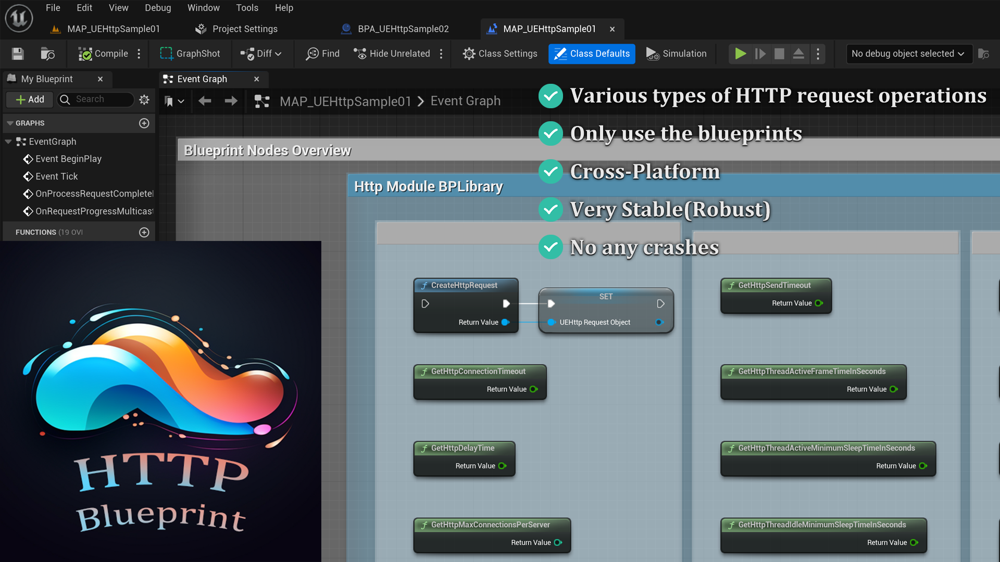

# SHORT DESCRIPTION：

Only need to use the blueprints, you can perform various types of HTTP request operations. And it is super stable.

# LONG DESCRIPTION：

Contains various types of HTTP request operations.: Eg. (GET, PUT, POST).
Just use the blueprint functions and don't need to use any C++ code.
This plugin encapsulates the internal Http module of Unreal Engine. 
This plugin is cross-platform and very stable.
We tested this plugin for a long time and verified that this plugin did not cause any crashes.

# TECHNICAL INFORMATION：

## Features: : 

- 
   Various types of HTTP request operations
-  Only use the blueprints
-  Cross-Platform
-  Very Stable(Robust)
-  No any crashes

# Blueprint nodes overview of "UEHttp"

**Blueprint Nodes overview is in the Level Blueprint Of:** "`UEHttpDemo/MAPs/MAP_UEHttpSample01`"

## Overview of UEHttp Blueprint Nodes:

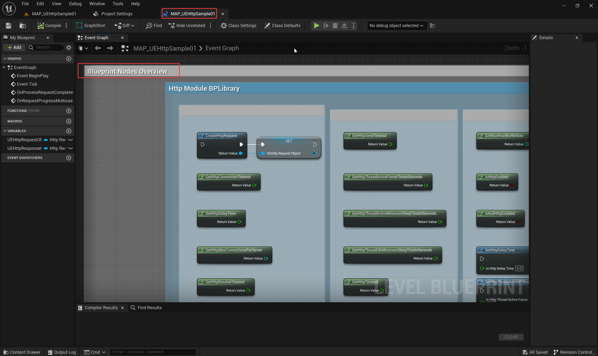

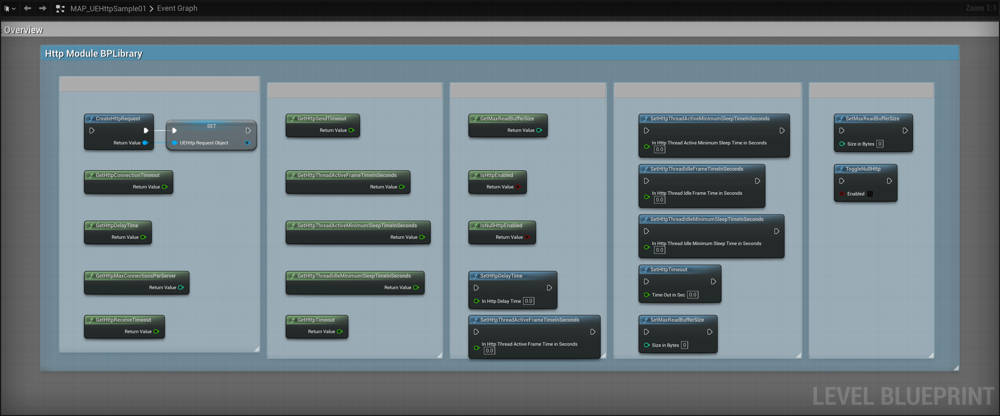

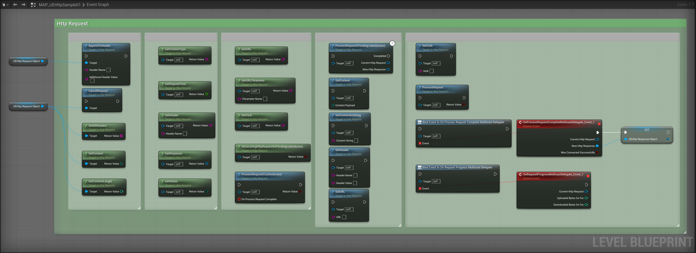

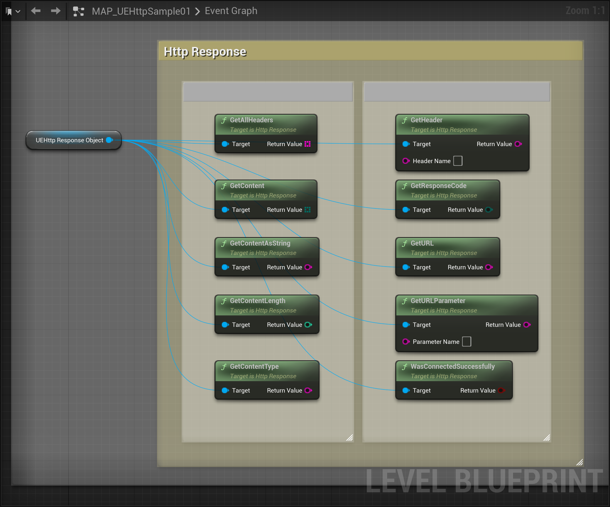

## Detailed description of each node

### Http BlueprintLibrary Nodes:

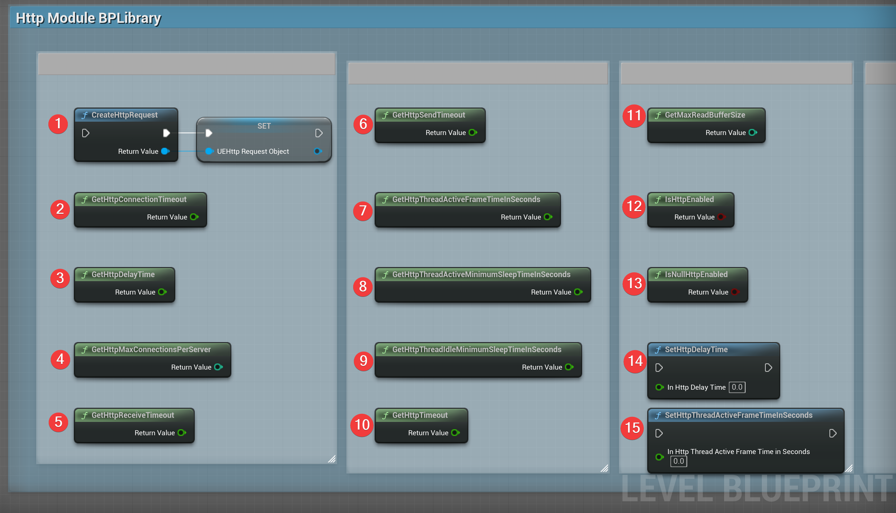

**"1"**: "**CreateHttpRequest**", Instantiates a new Http request for the current platform.

**"2"**: "**GetHttpConnectionTimeout**", timeout in seconds to establish the connection.

**"3"**: "**GetHttpDelayTime**", min delay time for each http request.

**"4"**: "**GetHttpMaxConnectionsPerServer**", max number of simultaneous connections to a specific server.

**"5"**: "**GetHttpReceiveTimeout**", timeout in seconds to receive a response on the connection.

**"6"**: "**GetHttpSendTimeout**", timeout in seconds to send a request on the connection.

**"7"**: "**GetHttpThreadActiveFrameTimeInSeconds**", Target tick rate of an active http thread.

**"8"**: "**GetHttpThreadActiveMinimumSleepTimeInSeconds**", Minimum sleep time of an active http thread.

**"9"**: "**GetHttpThreadIdleMinimumSleepTimeInSeconds**", Minimum sleep time when idle, waiting for requests.

**"10"**: "**GetHttpTimeout**", timeout in seconds for the entire http request to complete.

**"11"**: "**GetMaxReadBufferSize**", max read buffer size for http requests.

**"12"**: "**IsHttpEnabled**", true if http requests are enabled.

**"13"**: "**IsNullHttpEnabled**", true if null http is being used.

**"14"**: "**SetHttpDelayTime**", Set the min delay time for each http request.

**"15"**: "**SetHttpThreadActiveFrameTimeInSeconds**", Set the target tick rate of an active http thread.

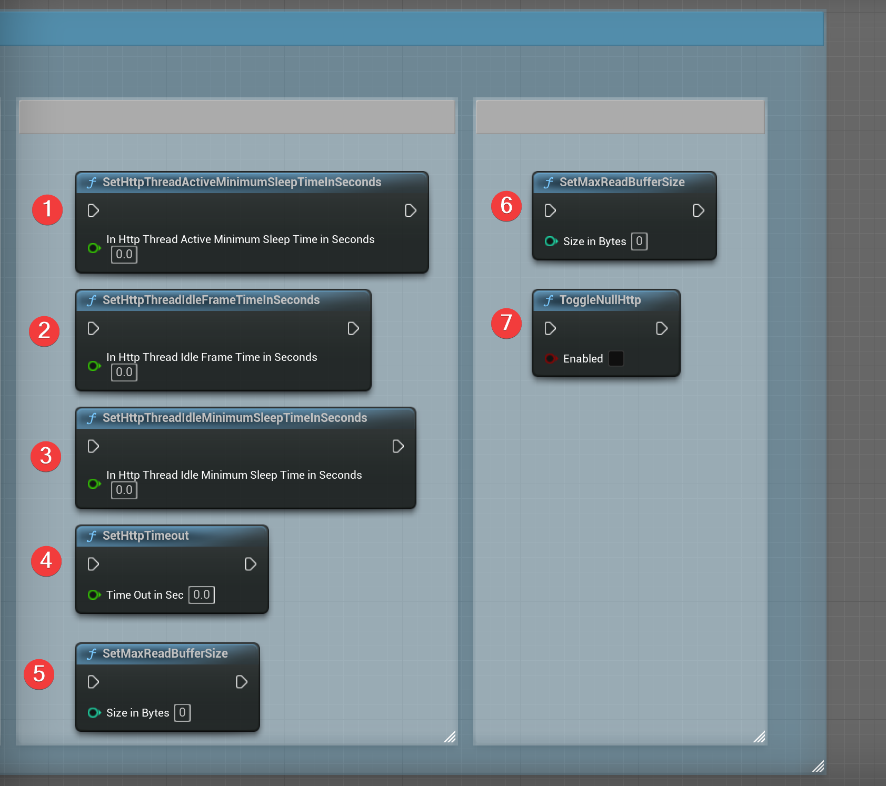

**"1"**: "**SetHttpThreadActiveMinimumSleepTimeInSeconds**", Set the minimum sleep time of an active http thread.

**"2"**: "**SetHttpThreadIdleFrameTimeInSeconds**", Set the target tick rate of an idle http thread.

**"3"**: "**SetHttpThreadIdleMinimumSleepTimeInSeconds**", Set the minimum sleep time when idle, waiting for requests.

**"4"**: "**SetHttpTimeout**", Sets timeout in seconds for the entire http request to complete.

**"5"**: "**SetMaxReadBufferSize**", Sets timeout in seconds for the entire http request to complete. "SizeInBytes" is the maximum number of bytes to use for the read buffer.

**"7"**: "**ToggleNullHttp**", toggle null http implementation.

### Http Request Blueprint Nodes:

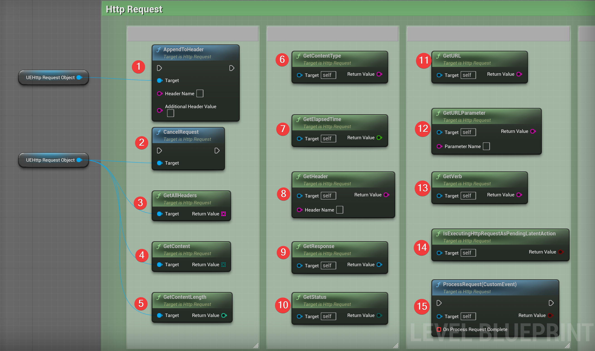

**"1"**: "**AppendToHeader**"

> Appends to the value already set in the header.
>
> If there is already content in that header, a comma delimiter is used.
>
> If the header is as of yet unset, the result is the same as calling SetHeader Content-Length is the only header set for you.
>
> Also see: SetHeader()
>
> @param HeaderName - Name of the header (ie, Content-Type)
>
> @param AdditionalHeaderValue - Value to add to the existing contents of the specified header. Comma is inserted between old value and new value, per HTTP specifications
> 

**"2"**: "**CancelRequest**", Called to cancel a request that is still being processed.

**"3"**: "**GetAllHeaders**",  Return all headers in an array in "Name: Value" format. 

**"4"**: "**GetContent**",  Get the content payload of the request or response.

**"5"**: "**GetContentLength**",  Shortcut to get the Content-Length header value. Will not always return non-zero. If you want the real length of the payload, get the payload and check it's length. Return the content length (if available).

**"6"**: "**GetContentType**", Shortcut to get the Content-Type header value (if available). Return the content type.

**"7"**: "**GetElapsedTime**",  Gets the time that it took for the server to fully respond to the request. Return elapsed time in seconds.

**"8"**: "**GetHeader**", Gets the value of a header, or empty string if not found. "HeaderName" is the name of the header to set.

**"9"**: "**GetResponse**", Get the associated Response.

**"10"**: "**GetStatus**", Get the current status of the request being processed.

**"11"**: "**GetURL**", Get the URL used to send the request.

**"12"**: "**GetURLParameter**"

> 	Gets an URL parameter.
> 	expected format is ?Key=Value&Key=Value...
> 	If that format is not used, this function will not work.
> 		
> 	@param ParameterName - the parameter to request.
> 	@return the parameter value string.

**"13"**: "**GetVerb**",  Gets the verb (GET, PUT, POST) used by the request.

**"14"**: "**IsExecutingHttpRequest_PendingLatentAction**", Returns true if any requests are still executing.

**"15"**: "**ProcessRequest(CustomEvent)**"

> 	Called to begin processing the request.
> 	OnProcessRequestComplete delegate is always called when the request completes or on error if it is bound.
> 	A request can be re-used but not while still being processed.
> 		
> 	@return if the request was successfully started.

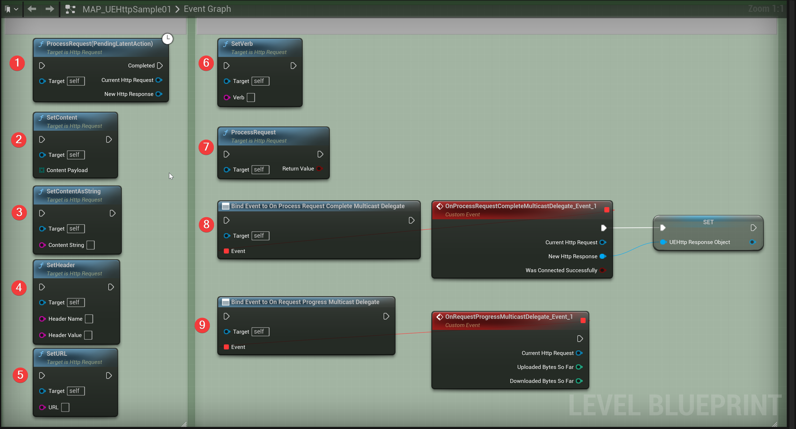

**"1"**: "**ProcessRequest(PendingLatentAction)**"

> 	Called to begin processing the request.
> 	OnProcessRequestComplete delegate is always called when the request completes or on error if it is bound.
> 	A request can be re-used but not while still being processed.
> 		
> 	@return if the request was successfully started.

**"2"**: "**SetContent**"

> 	Sets the content of the request (optional data).
> 	Usually only set for POST requests.
> 		
> 	@param ContentPayload - payload to set.

**"3"**: "**SetContentAsString**"

> 	Sets the content of the request as a string encoded as UTF8.
> 		
> 	@param ContentString - payload to set.

**"4"**: "**SetHeader**"

> 	Sets optional header info.
> 	SetHeader for a given HeaderName will overwrite any previous values
> 	Use AppendToHeader to append more values for the same header
> 	Content-Length is the only header set for you.
> 	Required headers depends on the request itself.
> 	Eg. "multipart/form-data" needed for a form post
> 		
> 	@param HeaderName - Name of the header (ie, Content-Type)
> 	@param HeaderValue - Value of the header

**"5"**: "**SetURL**"

> 	Sets the URL for the request
> 	Eg. (http://my.domain.com/something.ext?key=value&key2=value).
> 	Must be set before calling ProcessRequest.
> 		
> 	@param URL - URL to use.

**"6"**: "**SetVerb**"

> 	Sets the verb used by the request.
> 	Should be set before calling ProcessRequest.
> 	If not specified then a GET is assumed.
> 		
> 	@param Verb - verb to use.

**"7"**: "**ProcessRequest**"

> 	Called to begin processing the request.
> 	OnProcessRequestComplete delegate is always called when the request completes or on error if it is bound.
> 	A request can be re-used but not while still being processed.
> 		
> 	@return if the request was successfully started.

**"8"**: "**BindEventTo OnProcessRequestCompleteMulticastDelegate**"

> 	Delegate called when an Http request completes
> 		
> 	@param first parameter - original Http request that started things
> 	@param second parameter - response received from the server if a successful connection was established
> 	@param third parameter - indicates whether or not the request was able to connect successfully

**"9"**: "**BindEventTo OnRequestProgressMulticastDelegate**"

> 	Delegate called per tick to update an Http request upload or download size progress
> 		
> 	@param first parameter - original Http request that started things
> 	@param second parameter - the number of bytes sent / uploaded in the request so far.
> 	@param third parameter - the number of bytes received / downloaded in the response so far.

### Http Response Blueprint Nodes:

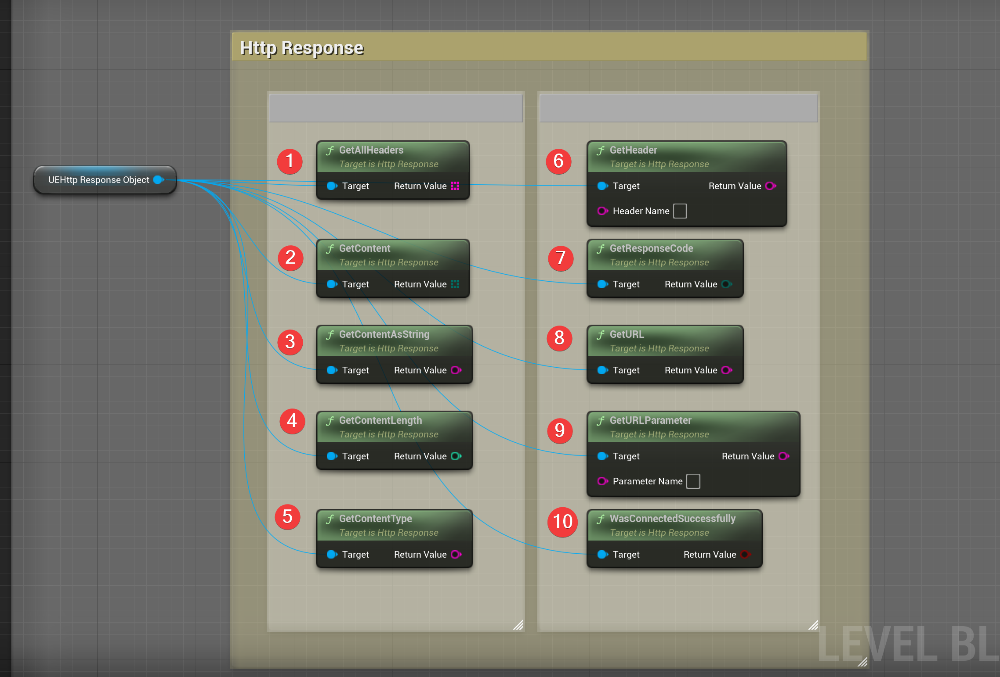

**"1"**: "**GetAllHeaders**", Return all headers in an array in "Name: Value" format.

**"2"**: "**GetContent**", Get the content payload of the request or response.

**"3"**: "**GetContentAsString**", Returns the payload as a string, assuming the payload is UTF8.

**"4"**: "**GetContentLength**"

> 	Shortcut to get the Content-Length header value. Will not always return non-zero.
> 	If you want the real length of the payload, get the payload and check it's length.
> 		
> 	@return the content length (if available)

**"5"**: "**GetContentType**", Shortcut to get the Content-Type header value (if available).

**"6"**: "**GetHeader**", Gets the value of a header, or empty string if not found. "HeaderName" is the name of the header to set.

**"7"**: "**GetResponseCode**",  Gets the response code returned by the requested server. See EHttpResponseCodes for known response codes. Return the response code.

**"8"**: "**GetURL**", Get the URL used to send the request.

**"9"**: "**GetURLParameter**"

> 	Gets an URL parameter.
> 	expected format is ?Key=Value&Key=Value...
> 	If that format is not used, this function will not work.
> 		
> 	@param ParameterName - the parameter to request.
> 	@return the parameter value string.

**"10"**: "**WasConnectedSuccessfully**",  true if the connection was successful.

# Example Introduction

## Example01:

 **Main Map:** '`/UEHttpDemo/MAPs/MAP_UEHttpSample01`'

**Blueprint Actor:** "`/UEHttpDemo/Samples/UEHttpSample01/BPA_UEHttpSample01`"

This example use the "BindEventToOnProcessRequestCompleteMulticastDelegate" and "ProcessRequest()" to get the Http Request data.

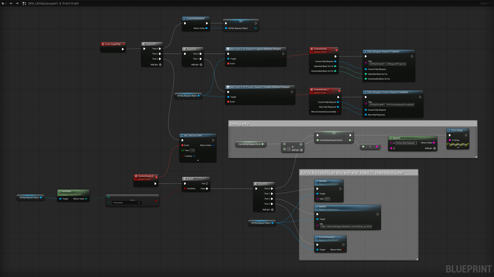

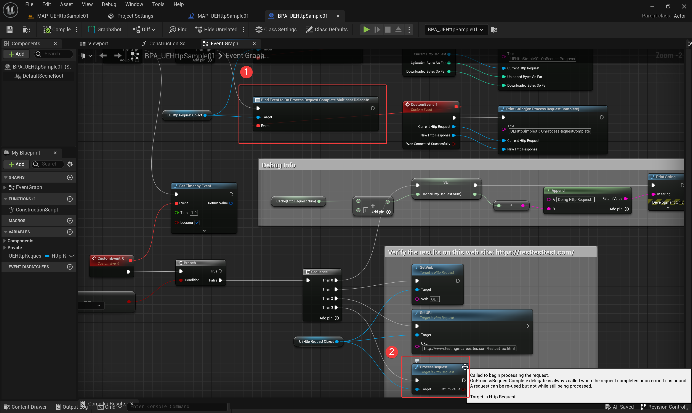

## Example02:

 **Main Map:** '`/UEHttpDemo/MAPs/MAP_UEHttpSample02`'

**Blueprint Actor:** "`/UEHttpDemo/Samples/UEHttpSample02/BPA_UEHttpSample02`"

This example use the "ProcessRequest(CustomEvent)" to get the Http Request data.

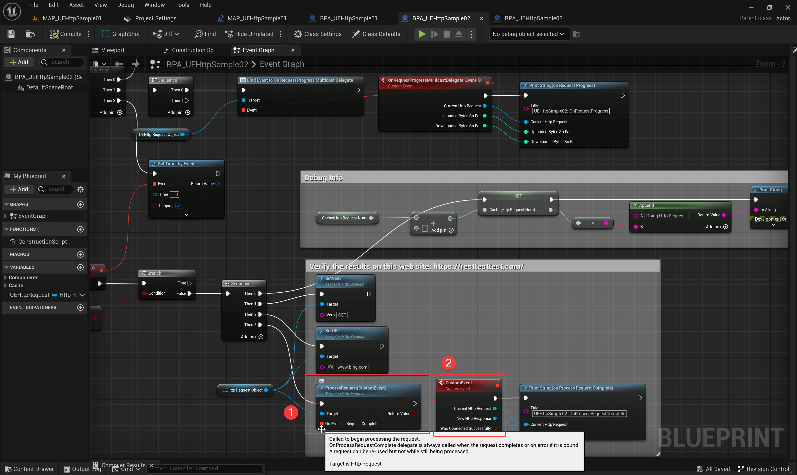

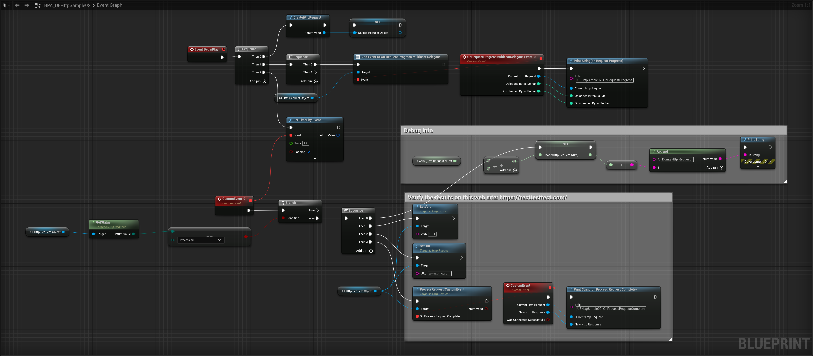

## Example03:

 **Main Map:** '`/UEHttpDemo/MAPs/MAP_UEHttpSample03`'

**Blueprint Actor:** "`/UEHttpDemo/Samples/UEHttpSample03/BPA_UEHttpSample03`"

This example use the "ProcessRequest(PendingLatentAction)" to get the Http Request data.

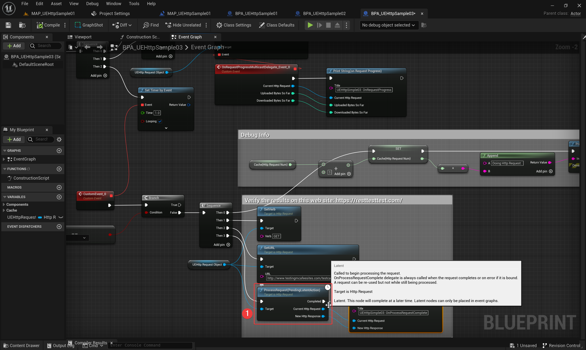

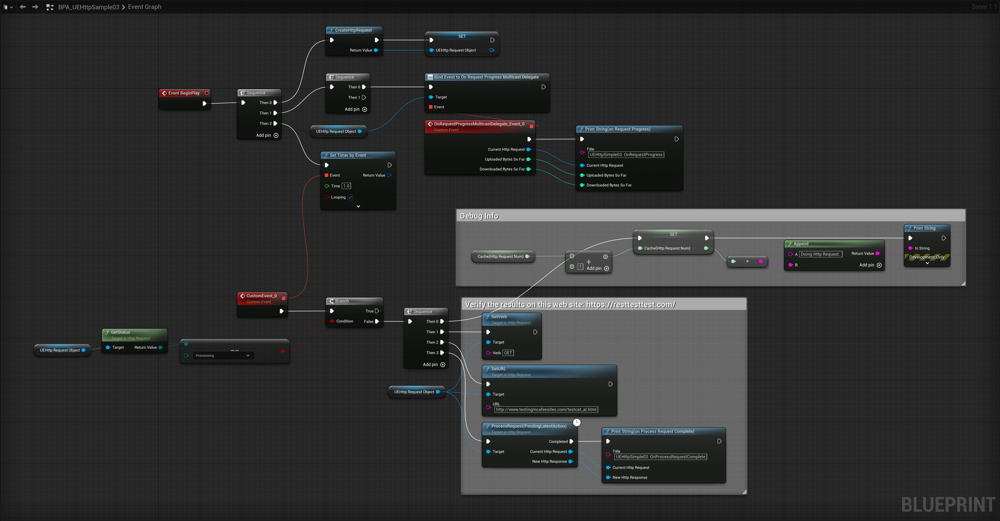